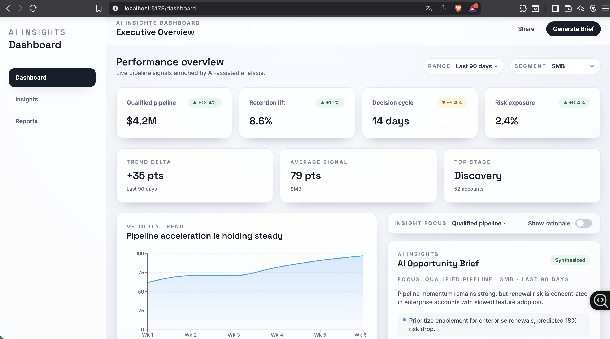
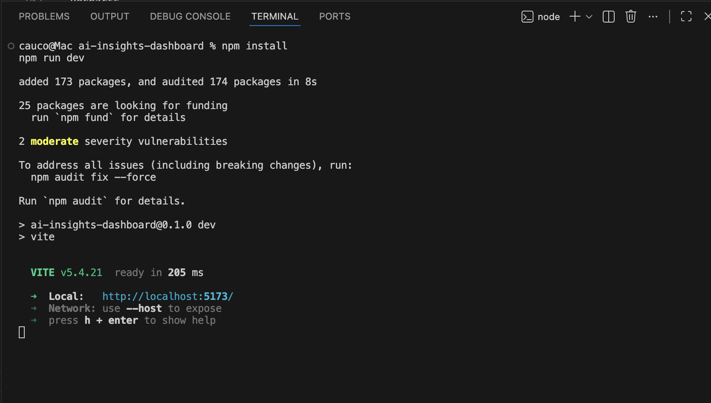

# AI Insights Dashboard

Portfolio-grade React + TypeScript dashboard that simulates AI-assisted analytics. Built to showcase product thinking, clear UI composition, and maintainable frontend architecture.

## Preview




## Architecture

- Feature-based structure keeps domain logic and UI cohesive without monolithic components.
- Shared UI primitives enable reuse while preserving visual consistency.
- Data access is isolated to make future API integration straightforward.
- Accessibility is treated as a baseline (keyboard focus, semantic structure, ARIA where needed).

## Data

All data is mock data, generated locally to simulate realistic AI insights.

## Local development

```bash
npm install
npm run dev
```
